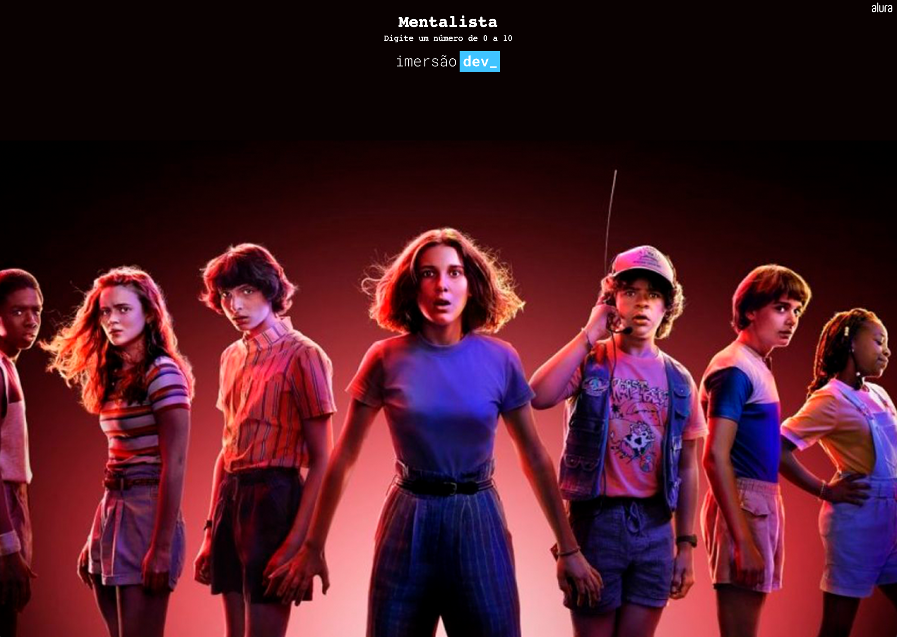

# 🔮 Mentalista
### 🧠 Currency converter
 

📸 Screenshot

#  🚀 Technologies

- [HTML](##HTML)
- [CSS](##CSS)
- [JavaScript](##JavaScript)
- [Github](##github)
- [Codepen](##codepen)
- [VScode](##vscode)

# 👩🏻‍💻 Project
Project made in immersion dev_ Alura's course of development for beginner

🪄✨

PT-BR: Projeto feito em curso imersão dev_ curso de desenvolvimento para iniciante da Alura

 #
 
                        Feito com 🤍 by BM

 #### 🔎 **[Online project here](https://codepen.io/biancamos/full/jOyrQpa)** Projeto desenvolvido em Agosto de 2022. 